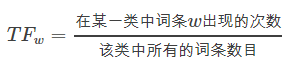
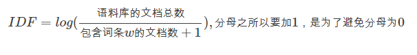
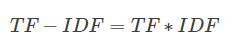

## TF-IDF是什么？


TF-IDF是一种统计方法，用以评估一字词对于一个文件集或一个语料库中的其中一份文件的重要程度,
TF-IDF加权的各种形式常被搜寻引擎应用，作为文件与用户查询之间相关程度的度量或评级。
除了TF-IDF以外，因特网上的搜寻引擎还会使用基于连结分析的评级方法，以确定文件在搜寻结果中出现的顺序。

- 一个词语在一篇文章中出现次数越多, 同时在所有文档中出现次数越少, 越能够代表该文章.

- 把文件(文本样本)中的词映射到一个相对合理的数值

- 文本转化为数据的方法


------

## TF

**词频 (term frequency, TF)** 指的是某一个给定的词语在该文件中出现的次数。这个数字通常会被归一化(一般是词频除以文章总词数), 以防止它偏向长的文件。（同一个词语在长文件里可能会比短文件有更高的词频，而不管该词语重要与否。）

<div align=center>

</div>


------
## IDF

**逆向文档频率 (inverse document frequency, IDF)** IDF的主要思想是：如果包含词条t的文档越少, IDF越大，则说明词条具有很好的类别区分能力。某一特定词语的IDF，可以由总文件数目除以包含该词语之文件的数目，再将得到的商取对数得到。

<div align=center>

</div>

------
## TF-IDF

某一特定文件内的高词语频率，以及该词语在整个文件集合中的低文件频率，可以产生出高权重的TF-IDF。因此，TF-IDF倾向于过滤掉常见的词语，保留重要的词语。 

<div align=center>

</div>

------
## TF-IDF的缺点

单纯以"词频"衡量一个词的重要性，不够全面，有时重要的词可能出现次数并不多。而且，这种算法无法体现词的位置信息，出现位置靠前的词与出现位置靠后的词，都被视为重要性相同，这是不正确的。也没有考虑词性。


## R与Python工具的实现

+ R

```r
#法1
set.seed(42)
d <- data.frame(w=sample(LETTERS, 50, replace=TRUE))
d <- model.matrix(~0+w, data=d)

tf <- d
idf <- log(nrow(d)/colSums(d))
tfidf <- d

for(word in names(idf)){
  tfidf[,word] <- tf[,word] * idf[word]
}

#法2 使用tm包或tmcn包
#read 1000 txt articles from directory data/txt
corpus  <- Corpus(DirSource("data/txt"), readerControl = list(blank.lines.skip=TRUE));
#some preprocessing
corpus <- tm_map(corpus, removeWords, stopwords("english"))
corpus <- tm_map(corpus, stripWhitespace)
corpus <- tm_map(corpus, stemDocument, language="english")
#creating term matrix with TF-IDF weighting
terms <-DocumentTermMatrix(corpus,control = list(weighting = function(x) weightTfIdf(x, normalize = FALSE)))

#or compute cosine distance among documents
dissimilarity(tdm, method = "cosine")

```

+ Python

```python
#法1：CountVectorizer+TfidfTransformer

from sklearn.feature_extraction.text import TfidfTransformer  
from sklearn.feature_extraction.text import CountVectorizer  

corpus = ["I come to China to travel", \
    "This is a car polupar in China", \         
    "I love tea and Apple ", \  
    "The work is to write some papers in science"] 

vectorizer = CountVectorizer()

transformer = TfidfTransformer()
tfidf = transformer.fit_transform(vectorizer.fit_transform(corpus))  
print tfidf

#法2：TfidfVectorizer

from sklearn.feature_extraction.text import TfidfVectorizer
tfidf2 = TfidfVectorizer()
re = tfidf2.fit_transform(corpus)
print re

```
