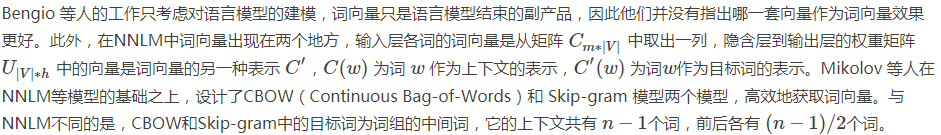
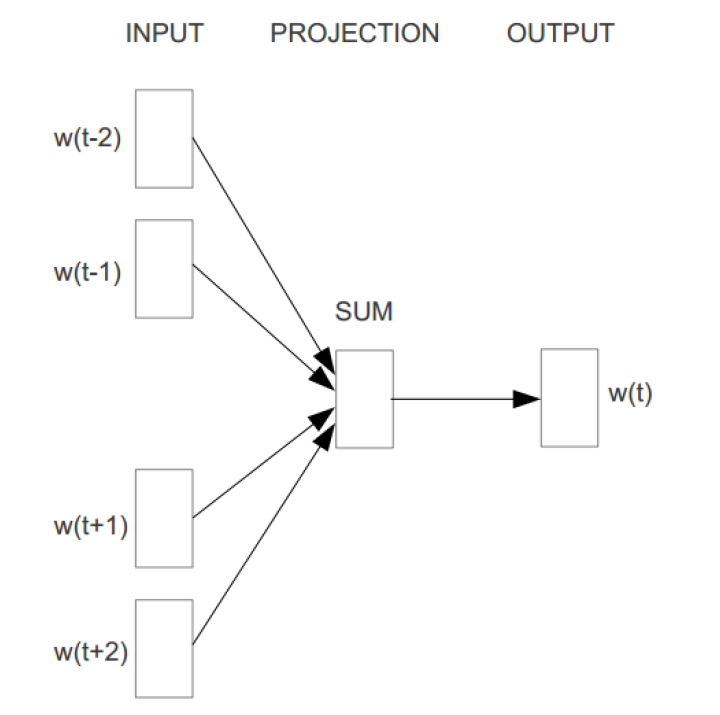
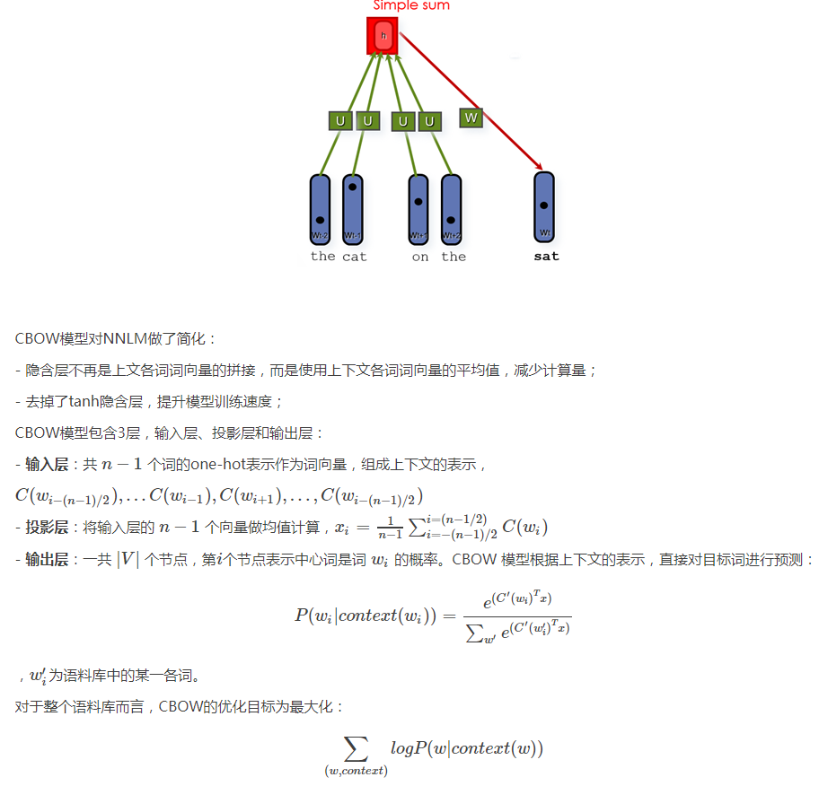
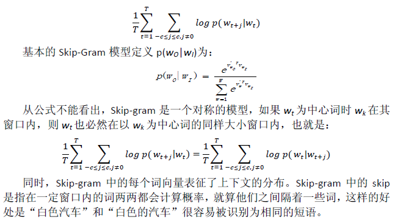
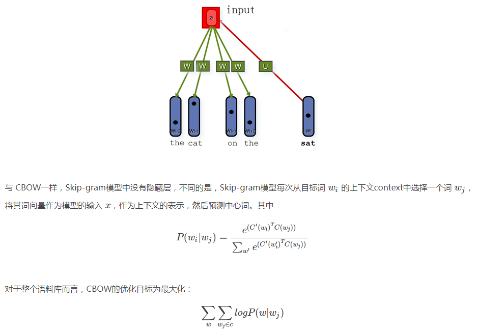

## 1.八卦时间

除了bengio之外, 不得不提的一个名字是：Jürgen Schmidhuber

------
## 2.什么是word2vec

+ word2vec是一个将单词转换成向量形式的工具。可以把对文本内容的处理简化为向量空间中的向量运算，计算出向量空间上的相似度，来表示文本语义上的相似度, 

+ 是由Google 2013年开源的项目。

+ 采用了新的Log-Bilinear模型主要有两个：CBOW和Skip-Gram

------
## 3.模型

NNLM模型只能处理定长的序列。在03年的论文里，Bengio等人将模型能够一次处理的序列长度NN提高到了55，虽然相比bigram和trigram已经是很大的提升，但依然缺少灵活性。

因此，Mikolov等人在2010年提出了一种RNNLM模型，用递归神经网络代替原始模型里的前向反馈神经网络，并将embedding层与RNN里的隐藏层合并，从而解决了变长序列的问题。

另一个问题就比较严重了。NNLM的训练太慢了。即便是在百万量级的数据集上，即便是借助了40个CPU进行训练，NNLM也需要耗时数周才能给出一个稍微靠谱的解来。显然，对于现在动辄上千万甚至上亿的真实语料库，训练一个NNLM模型几乎是一个不可能的事情。

这时候，还是那个Mikolov站了出来。他注意到，原始的NNLM模型的训练其实可以拆分成两个步骤：

用一个简单模型训练出连续的词向量；
基于词向量的表达，训练一个连续的Ngram神经网络模型。
而NNLM模型的计算瓶颈主要是在第二步。
如果我们只是想得到word的连续特征向量，是不是可以对第二步里的神经网络模型进行简化呢？

Mikolov是这么想的，也是这么做的。他在2013年一口气推出了两篇paper，并开源了一款计算词向量的工具——至此，word2vec横空出世，主角闪亮登场。

有了前文的基础，理解word2vec算法就变得很简单了

### A.CBOW

首先，我们对原始的NNLM模型做如下改造：

+ 移除前向反馈神经网络中非线性的hidden layer，直接将中间层的embedding layer与输出层的softmax layer连接；

+ 忽略上下文环境的序列信息：输入的所有词向量均汇总到同一个embedding layer；

+ 将future words纳入上下文环境

得到的模型称之为CBoW模型（Continuous Bag-of-Words Model），也是word2vec算法的第一个模型：

从数学上看，CBOW模型等价于一个词袋模型的向量乘以一个embedding矩阵，从而得到一个连续的embedding向量。这也是CBOW模型名称的由来。

CBOW模型依然是从context对target word的预测中学习到词向量的表达。反过来，我们能否从target word对context的预测中学习到word vector呢？答案显然是可以的。

### B.Skip-Gram

------
## 4.Tricks

两种模型在训练的过程中采用了两种算法：层次softmax和Negative Sampling，
同时在Google开源的word2vec算法中使用了Huffman编码，指数运算，按word分布随机抽样，高频词亚采样等概念，关于这里的Trick我在6月份NLP的培训中已经做了详细的介绍，不赘述。

相关Tick感兴趣自己去查。

------
## 5.小结

word2vec是一种快速把文本切词后的语料快速转化成词向量的方法，说白了是一种高效的词表示方法，主要模型就是我在上文中介绍的CBOW和Skip-Gram。
word2vec模型如何在R和Python中应用我在6月份的NLP培训中已经详细的讲过，不再赘述。

