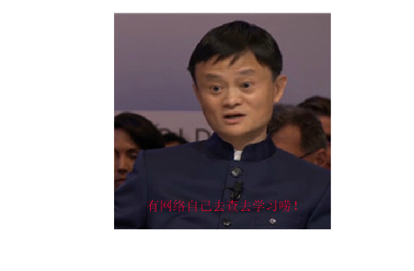

## seq2seq(感兴趣自己研究)

Seq2Seq技术，全称Sequence to Sequence，该技术突破了传统的固定大小输入问题框架，开通了将经典深度神经网络模型（DNNs）运用于翻译与智能问答这一类序列型（Sequence Based，项目间有固定的先后关系）任务的先河，并被证实在英语－法语翻译、英语－德语翻译以及人机短问快答的应用中有着不俗的表现。笔者尝试用自己的语言对Seq2Seq进行简单的介绍，帮助有兴趣的朋友撬开人工智能神秘的大门。

Seq2Seq被提出于2014年，最早由两篇文章独立地阐述了它主要思想，分别是Google Brain团队的《Sequence to Sequence Learning with Neural Networks》和Yoshua Bengio团队的《Learning Phrase Representation using RNN Encoder-Decoder for Statistical Machine Translation》。这两篇文章针对机器翻译的问题不谋而合地提出了相似的解决思路，Seq2Seq由此产生。

Seq2Seq解决问题的主要思路是通过深度神经网络模型（常用的是LSTM，长短记忆网络，一种循环神经网络）将一个作为输入的序列映射为一个作为输出的序列，这一过程由编码输入与解码输出两个环节组成

**有论文，有网络资源自查**
