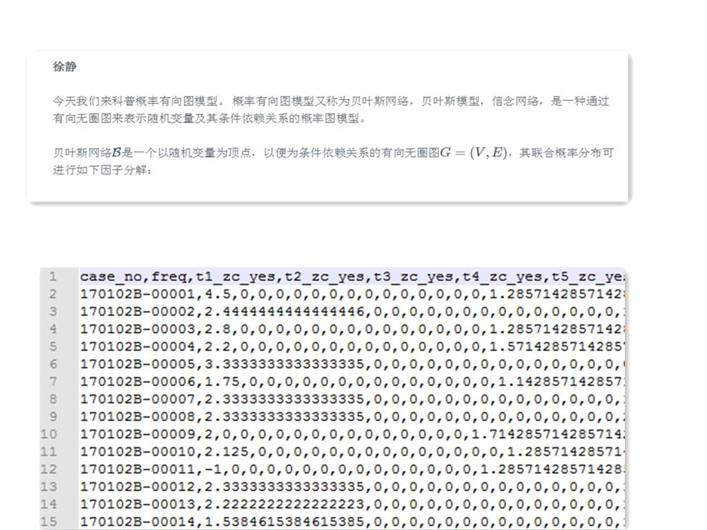

# Welcome to NLP Learning Base 2

More learning: XuJing'Home [https://dataxujing.coding.me/](https://dataxujing.coding.me/)

----

+ TF-IDF

+ Embadding

+ word2vec

+ seq2seq

+ test2vec (是一个R package)

----

不会详细介绍推导过程和理论依托，主要侧重于理解算法原理及快速应用

----

NLP的难点和重点主要有两个：

+ 非结构化的数据转化成‘合理’的结构化数据

+ 建模

**图1：本教程解决的问题**

